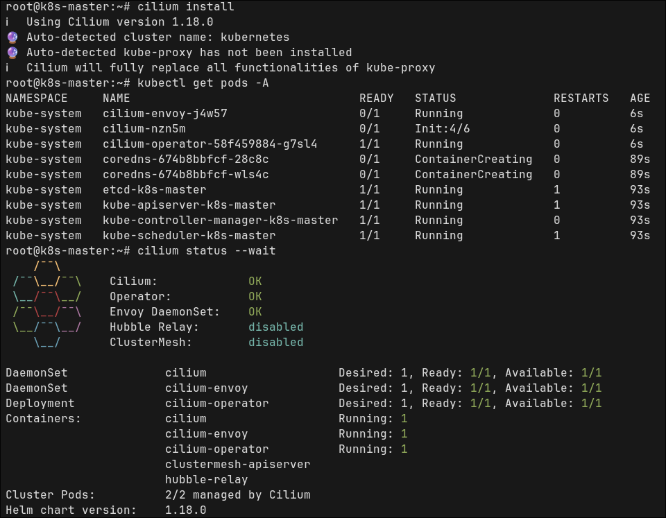

### System Prerequisites

- Disable swap

```fish
sudo swapoff -a
```

- Disable from fstab line with swap partition, `add # at start`

```fish
sudo sed -i '/ swap / s/^/#/' /etc/fstab
```

- Configure kernel modules and networking

```fish
cat <<EOF | sudo tee /etc/modules-load.d/containerd.conf
overlay
br_netfilter
EOF

sudo modprobe overlay
sudo modprobe br_netfilter

cat <<EOF | sudo tee /etc/sysctl.d/99-kubernetes-cri.conf
net.bridge.bridge-nf-call-iptables = 1
net.ipv4.ip_forward = 1
net.bridge.bridge-nf-call-ip6tables = 1
EOF

sudo sysctl --system
```

### Install containerd (Ubuntu)

- https://docs.docker.com/engine/install/ubuntu
- follow steps in docs and install it

```fish
sudo apt-get install containerd.io
```

- generate default containerd config, open it and [follow these steps](https://kubernetes.io/docs/setup/production-environment/container-runtimes/#containerd)

```fish
sudo mkdir -p /etc/containerd
sudo containerd config default | sudo tee /etc/containerd/config.toml

vim /etc/containerd/config.toml
```

### Install kubeadm, kubelet and kubectl

- [follow these steps](https://kubernetes.io/docs/setup/production-environment/tools/kubeadm/install-kubeadm/#installing-kubeadm-kubelet-and-kubectl)

> [!WARNING] Wait!
> all those steps before, you need to do also for worker nodes

### init cluster

> it will print some instructions to run

```fish
sudo kubeadm init --pod-network-cidr=10.244.0.0/16 --skip-phases=addon/kube-proxy
```

### Install helm

- [follow these steps](https://helm.sh/docs/intro/install)

### Install cilium with helm

- [follow these steps](https://docs.cilium.io/en/stable/installation/k8s-install-helm/#installation-using-helm)
- after that, install cilium cli and wait for status validation

```fish
cilium status --wait
```

### Check if k8s master node correctly configured

```fish
nc 127.0.0.1 6443 -zv -w 2

kubectl get pods -A
```

- first command should print something like
- `Connection to 127.0.0.1 6443 port [tcp/*] succeeded!`
- for second one everything should be in `Running` status


